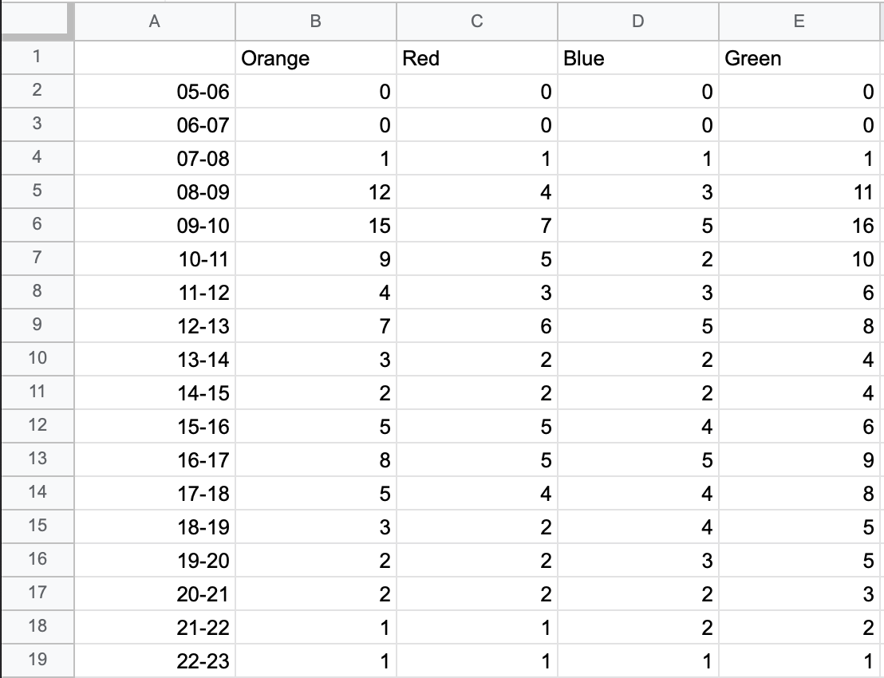
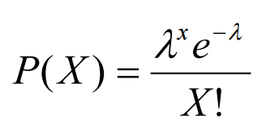
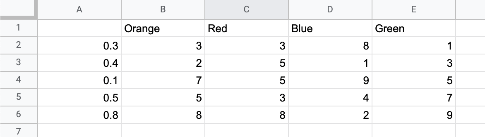
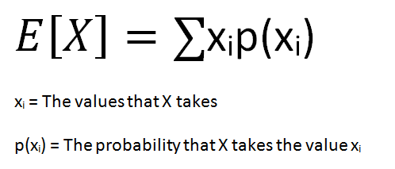
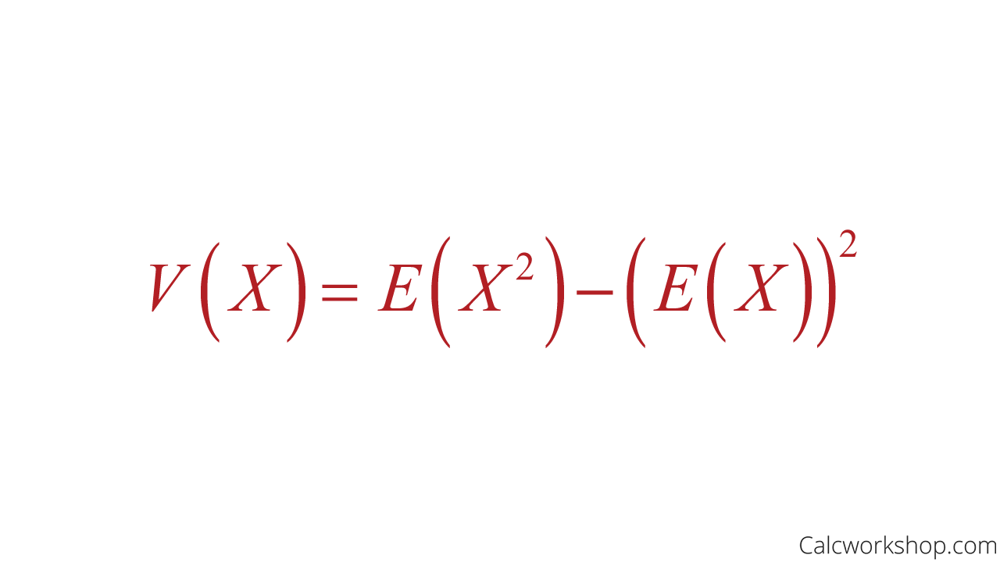

# CS2810 Mini-Project: High-Tech MBTA Statistical Analysis
created by Ariel Shtivelberg and Gavin White

## Project Description
### Task:
Having been contacted by the City of Boston to redesign the MBTA T System, we found it in our hearts 
to tackle this concern with user satisfaction. We needed to be able to computer and evaluate the trends,
values, times, etc. for various observations made of each MBTA line. Whether observations for the 
number of minutes a train was delayed on a given day, or the number of delayed trains that occurred
by the hour, recording our observations allowed for a statistical analysis to be done.

### Computing Poisson's Distribution
Computing this distribution over certain time intervals meant observing the number of delayed cars 
for a specific train, at each hour of the day. Every hour from 5 AM to 11 AM, the busiest hours of
operation for the MBTA, the number of delayed trains were tallied up and recorded in the table used 
in the program. The formatting of the table must be as follows:
  
In this table, the topmost row stores the line names for the MBTA where there are currently the Orange,
Red, Green, and Blue lines. The line names start in the second column. In the first column, and starting
from the second row, times of the day are listed in one hour intervals following the format "HH-HH"
where the first HH is the start time and the second HH is the end time. Computing Poisson's Distribution
requires the formula:
  
Where lambda is the average number of events given our data, _e_ is Euler's number and k is the number
of occurrences. What this Poisson Distribution calculates is the probability that you exprience k delays
between the provided start and end times given the data observed.

### Expected Value & Variance
For computing expected values and variances of wait times, data was recorded in a manner where throughout
one day, several average wait times were recorded for each line and the probability that the wait
was in fact that long. Written out in a table, the format follows:
  
In this table, the topmost row stores the line names for the MBTA where there are currently the Orange,
Red, Green, and Blue lines. The line names start in the second column. In the first column, and starting
from the second row, probabilities for a given wait time are listed. Computing the Expected Value and Variance
requires the following formulas:
  
  

